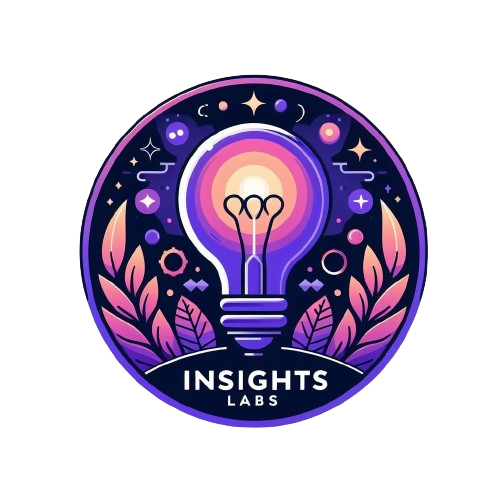

<!-- PROJECT SHIELDS -->
[![Contributors][contributors-shield]][contributors-url]
[![Forks][forks-shield]][forks-url]
[![Stargazers][stars-shield]][stars-url]
[![Issues][issues-shield]][issues-url]
[![MIT Licencia][Licencia-shield]][Licencia-url]

<!-- PROJECT LOGO -->
 

  

<h3 align="center">YELP & GOOGLE MAPS - REVIEWS AND RECOMMENDATIONS</h3>

  

    Desarrollo de un Data Product mediante el análisis del mercado estadounidense de comida vegetariana y afines, usando datos de Yelp y Google Maps
     
    <a href="https://github.com/Insights-Labs-Consultant-Agency/yelp-google-maps-reviews-and-recommendations/wiki"><strong>Explorar la documentación »</strong></a>
     
     
    <a href="https://github.com/Insights-Labs-Consultant-Agency/yelp-google-maps-reviews-and-recommendations/issues">Reportar Bug</a>
    ·
    <a href="https://github.com/Insights-Labs-Consultant-Agency/yelp-google-maps-reviews-and-recommendations/issues">Request Feature</a>
  

<!-- Tabla de contenido -->

  
Tabla de contenido

  <ol>
    <li><a href="#acerca-del-proyecto">Acerca del Proyecto</a></li>
    <li><a href="#nuestro-cliente">Nuestro Cliente</a></li>
    <li><a href="#planteamiento-del-problema">Planteamiento del Problema</a></li>
    <li>
      <a href="#objetivos">Objetivos</a>
      <ul>
        <li><a href="#objetivo-general">Objetivo General</a></li>
        <li><a href="#objetivos-específicos">Objetivos Específicos</a></li>
      </ul>
    </li>
    <li><a href="#kpis">KPIs</a></li>
    <li>
      <a href="#alcance">Alcance</a>
      <ul>
<!--         <li><a href="#alcance-temporal">Alcance Temporal</a></li> -->
        <li><a href="#alcance-espacial">Alcance Espacial</a></li>
      </ul>
    </li>
    <li><a href="#metodología-de-trabajo">Metodología de Trabajo</a></li>
    <li><a href="#data-product">Data Product</a></li>
    <li><a href="#stack-tecnológico">Stack Tecnológico</a></li>
    <li><a href="#roadmap">Roadmap</a></li>
    <li><a href="#contribuciones">Contribuciones</a></li>
    <li><a href="#licencia">Licencia</a></li>
    <li><a href="#sobre-nosotros">Sobre Nosotros</a></li>
    <li><a href="#nuestro-equipo">Nuestro Equipo</a></li>
    <li><a href="#contacto">Contacto</a></li>
    <!-- <li><a href="#agradecimientos">Agradecimientos</a></li> -->
  </ol>

<!-- Acerca del Proyecto -->
## Acerca del Proyecto

<!-- 

  

 -->

Este proyecto corresponde al Proyecto Final de la etapa de Labs del programa de Data Science de Henry, donde se trata de analizar el mercado estadounidense de comida vegetariana y afines, usando datos de Yelp y Google Maps. Se busca entender las opiniones y preferencias de los usuarios de ambas plataformas, así como las tendencias y oportunidades de negocio en el sector. El objetivo es crear data products que permitan realizar análisis de sentimientos, predecir el crecimiento o decrecimiento del rubro de comida vegetariana y afines, sugerir las mejores ubicaciones para los nuevos locales, crear un sistema de recomendación de restaurantes personalizado, un asistente virtual para los usuarios y un generador de recetas vegetarianas y/o saludables.

(<a href="#readme-top">volver arriba</a>)

<!-- NUESTRO CLIENTE -->
## Nuestro Cliente

Nuestro cliente es un conglomerado de empresas de restaurantes de comida vegetariana y afines, que desea expandir su mercado y ofrecer una mejor experiencia a sus clientes. El conglomerado está formado por tres franquicias: envegan, NuVegan Cafe y Veggie Grill. Puedes conocer más sobre las franquicias en la sección [Nuestro Cliente](https://github.com/Insights-Labs-Consultant-Agency/yelp-google-maps-reviews-and-recommendations/wiki#nuestro-cliente) de la documentación asociada en la Wiki.

(<a href="#readme-top">volver arriba</a>)

<!-- problem statement section -->
## Planteamiento del Problema

El mercado estadounidense de comida vegetariana está en constante crecimiento, pero también es competitivo y dinámico. Para tener éxito en este mercado, es necesario conocer a fondo el comportamiento y las opiniones de los clientes. Los datos de Yelp y Google Maps son valiosas fuentes de información sobre las opiniones y comportamientos de los usuarios pero su análisis también implica desafíos técnicos y metodológicos.

El proyecto requiere técnicas avanzadas de análisis de sentimientos y predicción de tendencias que permitan generar insights accionables para el cliente, sugerencias de ubicaciones para nuevas franquicias y recomendaciones de restaurantes personalizadas para los usuarios.

La importancia y relevancia de este proyecto radica en que se busca aportar al conocimiento y la comprensión del mercado estadounidense de comida vegetariana y afines, así como brindar soluciones que beneficien a nuestro cliente y sus usuarios. Para ampliar la información y conocer las preguntas de investigación planteadas puedes consultar la sección [Planteamiento del Problema](https://github.com/Insights-Labs-Consultant-Agency/yelp-google-maps-reviews-and-recommendations/wiki#planteamiento-del-problema) en la documentación.

(<a href="#readme-top">volver arriba</a>)

## Objetivos

### Objetivo General

- Proporcionar un análisis completo de los datos de las plataformas Yelp y Google Maps, que permita desarrollar un plan de expansión al conglomerado de franquicias de comida vegana aumentar su cuota de mercado, mejorar su reputación y satisfacer las necesidades de los consumidores veganos en los estados de Florida, Nevada y Virginia.

### Objetivos Específicos

- Detectar las localidades dentro de los estados objetivos donde hay mayor posibilidad de expansión de las franquicias, mediante un análisis de mercado que tenga en cuenta variables como la demanda, la competencia, el perfil de los clientes potenciales y los factores externos. 
- Establecer un modelo de NLP para analizar las reseñas de las franquicias e identificar las características que más valoran los consumidores veganos y obtener un informe con los aspectos positivos y negativos de cada franquicia, y las sugerencias de mejora para el menú y la oferta.
- Desarrollar un sistema de recomendación de restaurantes que pueda ofrecer recomendaciones personalizadas, basadas en las experiencias previas y las preferencias de los usuarios. 
- Realizar un chatbot basado en NLP para responder a las preguntas de los clientes y proporcionarles información sobre las franquicias, que pueda interactuar  de forma natural, fluida y precisa para resolver sus dudas, sugerencias y reclamos. 

(<a href="#readme-top">volver arriba</a>)

<!-- KPIs section -->
## KPIs

### 1. Satisfacción al cliente

* **Métrica**: Cantidad de reseñas positivas
* **Objetivo**: Aumentar 10% las reseñas positivas trismetralmente.

$$
\mathrm{KPI}=\dfrac{R_{positivos}}{R_{total}}\cdot100
$$

### 2. Cantidad de interacciones por sucursal

* **Métrica**: Cantidad de interacciones en las sucursales. Cantidad total de reseñas por sucursales/cantidad total de reseñas.
* **Objetivo**: Aumentar 5% las reseñas positivas por sucursal mensualmente.

$$
\mathrm{KPI}=\dfrac{R_{sucursal}}{R_{total}}\cdot100
$$

### 3. Satisfacción del cliente respecto al servicio

* **Métrica**: Cantidad de comentarios positivos respecto al servicio sobre cantidad de comentarios totales respecto al servicio.
* **Objetivo**: Aumentar 5% la cantidad de comentarios positivos por servicio mensualmente.

$$
\mathrm{KPI}=\dfrac{R_{servicio}^{+}}{R_{totalservicio}}\cdot100
$$

### 4. Oferta/Demanda de comida saludable

* **Métrica**: Cantidad de total de restaurantes de comida saludable/cantidad de total de reseñas de restaurantes de comida saludable por localidad.
* **Objetivo**: Identificar el top 3 de localidades potenciales por estado.

$$
\mathrm{KPI}=\dfrac{Total_{restaurantes}}{R_{total}}\cdot100
$$

Para más información sobre el criterio empleado para la construcción de los KPIs puedes consultar la documentación asociada en la sección [KPIs](https://github.com/Insights-Labs-Consultant-Agency/yelp-google-maps-reviews-and-recommendations/wiki/KPIs) de la wiki.

(<a href="#readme-top">volver arriba</a>)

<!-- scope section -->
## Alcance

<!-- ### Alcance Temporal -->

### Alcance Espacial
Se realizó una delimitación espacial del proyecto mediante un análisis georreferencial utilizando Google Maps para mapear las ubicaciones de las franquicias existentes del cliente, que se concentran principalmente en las costas este y oeste de los EE. UU.

Mediante un análisis de tendencias utilizando Google Trends se analizó la popularidad de la comida vegana, vegetariana y saludable en los EE. UU., para identificar los mejores estados para el plan de expansión, determinando a Nevada, Virginia y Florida como los estados más prometedores para abrir nuevas franquicias. Para conocer más detalles de como se desarrollaron estos análisis puedes consultar la documentación asociada en la sección [Alcance](https://github.com/Insights-Labs-Consultant-Agency/yelp-google-maps-reviews-and-recommendations/wiki/Alcance) de la Wiki. 

(<a href="#readme-top">volver arriba</a>)

<!-- METODOLOGIA -->
## Metodología de trabajo

El proyecto se desarrollará en un plazo de tres semanas, dividido en tres sprints, siguiendo una metodología ágil y colaborativa dentro de los marcos de gestión de proyectos Scrum y Kanban, y utilizando Github Projects, Github Wiki y Github Flow como herramientas de gestión, documentación y desarrollo. Estas herramientas permiten gestionar el proyecto de forma iterativa e incremental, adaptarse a los cambios y requerimientos del cliente, y entregar valor en cada sprint. Para más información sobre la [metodología de trabajo](https://github.com/Insights-Labs-Consultant-Agency/yelp-google-maps-reviews-and-recommendations/wiki/Metodolog%C3%ADa-de-Trabajo) puedes consultar la documentación asociada en la wiki.

(<a href="#readme-top">volver arriba</a>)

<!-- product section -->
## Data Product

El data product a desarrollar en este proyecto tiene como nombre Yoogle, el cual permite obtener insights sobre el mercado estadounidense de restaurantes de comida saludable y afines, utilizando datos de las plataformas Yelp y Google Maps, puede generar recomendaciones de restaurantes, recetas y cuenta con un asistente virtual. Yoogle se presenta como una aplicación web interactiva, desarrollada con la herramienta Streamlit, que proporciona una interfaz gráfica amigable y ofrece varias secciones y funcionalidades para diferentes tipos de usuarios. Para conocer más sobre nuestro producto, sus funcionalidades y características puedes consultar la documentación asociada en la sección [Descripción del Producto](https://github.com/Insights-Labs-Consultant-Agency/yelp-google-maps-reviews-and-recommendations/wiki/Descripción-del-Producto) de la wiki. 

<!-- STACK TECNOLOGICO -->
## Stack tecnológico

Para el desarrollo del proyecto, se eligió un stack tecnológico basado en servicios de AWS, que permite construir una arquitectura de datos moderna, de bajo costo y centrada en data lakes usando servicios sin servidor administrados por AWS que ofrecen una solución, escalable, flexible y segura para el procesamiento de datos. Para más información sobre el stack tecnológico, la arquitetura y el flujo de trabajo puedes consultar la documentación asociada en la sección [Stack Tecnológico](https://github.com/Insights-Labs-Consultant-Agency/yelp-google-maps-reviews-and-recommendations/wiki/Stack-Tecnol%C3%B3gico) de la wiki.

(<a href="#readme-top">volver arriba</a>)

<!-- USAGE EXAMPLES -->
<!-- ## Uso

(<a href="#readme-top">volver arriba</a>)
 -->

<!-- roadmap section -->
## Roadmap

Este proyecto se encuentra en fase de desarrollo, puedes consultar el roadmap completo en la sección [GitHub Projects](https://github.com/orgs/Insights-Labs-Consultant-Agency/projects/2/views/4).

Consulta los [issues abiertos](https://github.com/Insights-Labs-Consultant-Agency/yelp-google-maps-reviews-and-recommendations/issues) para conocer las tareas en desarrollo y los [hitos](https://github.com/Insights-Labs-Consultant-Agency/yelp-google-maps-reviews-and-recommendations/milestones) a alcanzar.

(<a href="#readme-top">volver arriba</a>)

<!-- CONTRIBUTING -->
## Contribuciones

Las contribuciones son lo que hacen que la comunidad de código abierto sea un lugar increíble para aprender, inspirarse y crear. Cualquier contribución que hagas será **muy apreciada**.

Si tienes una sugerencia para mejorar este proyecto, haz un fork del repositorio y crea un pull request. También puedes simplemente abrir un issue con la etiqueta *“enhancement”*. ¡No olvides darle una estrella al proyecto! Gracias de nuevo.

1. Haz un fork del Proyecto
2. Crea tu feature Branch (`git checkout -b feature/AmazingFeature`)
3. Haz commits de tus cambios (`git commit -m 'Add some AmazingFeature'`)
4. Haz Push a la Branch (`git push origin feature/AmazingFeature`)
5. Abre un Pull Request

(<a href="#readme-top">volver arriba</a>)

<!-- license section -->
## Licencia

Distribuido bajo la licencia MIT. Consulta el archivo [LICENSE](LICENSE) para más información.

(<a href="#readme-top">volver arriba</a>)

<!-- About us section-->
## Sobre nosotros
**Insights Labs** 🚀 es una consultora de análisis de datos que ayuda a las empresas a tomar mejores decisiones basadas en datos. Ofrecemos servicios de investigación, visualización, modelado y machine learning, utilizando las mejores herramientas y metodologías del mercado.

(<a href="#readme-top">volver arriba</a>)

<!-- team section -->
## Nuestro Equipo 

| Equipo              | Rol            | Perfil  |  Nombre              | LinkedIn | GitHub |
|-------------------- | -------------- | - |--------------------- | -------- |-|
| Data Infrastructure | Data Engineer  |  | Jimmy Pachon          | [![LinkedIn][linkedin-shield]][linkedin-pachon]  | [![GitHub][github-shield]][github-pachon] |
| Data Research       | Data Analyst   |  | Freddy Ampueda        | [![LinkedIn][linkedin-shield]][linkedin-ampueda] | [![GitHub][github-shield]][github-ampueda] |
| Machine Learning    | Data Scientist |   | Freddy Pinto          | [![LinkedIn][linkedin-shield]][linkedin-pinto]   | [![GitHub][github-shield]][github-pinto]  |
| Data Visualization  | Data Analyst   |  | Javier Pizarro        | [![LinkedIn][linkedin-shield]][linkedin-pizarro] | [![GitHub][github-shield]][github-pizarro] |
| Data Visualization  | Data Analyst   |  | Cristopher Morales    | [![LinkedIn][linkedin-shield]][linkedin-morales] | [![GitHub][github-shield]][github-morales] |
<!-- | Project Management  | Scrum Master   |  |Maximiliano Vaca Coll |       ||
| Project Management  | Product Owner  | |Angela Aguirre         |       || -->

(<a href="#readme-top">volver arriba</a>)

<!-- Contact Section -->
## Contacto

- 🔗 Página Web: [www.insights-labs-consultant-agency.com](insights-labs-consultant-agency.github.io/yelp-google-maps-reviews-and-recommendations/)

- 📧 Email: insightslabsconsultantagency@gmail.com 

(<a href="#readme-top">volver arriba</a>)

<!-- ACKNOWLEDGMENTS -->
<!-- ## Agradecimientos
Queremos agradecer a las siguientes personas y recursos que nos han ayudado a realizar este proyecto:

* A [SoyHenry](https://www.soyhenry.com/) por ofrecernos esta gran oportunidad de participar en el bootcamp de data science y aprender sobre MLOps.
* A la comunidad de Henry, especialmente a [Maximiliano Vaca Coll]() que nos ha apoyado y guiado durante el proceso de desarrollo de este proyecto.

(<a href="#readme-top">volver arriba</a>)
 -->

<!-- Disclaimer -->
>[!WARNING]
 Disclaimer: Este proyecto es un trabajo académico realizado como parte del Proyecto Final de la etapa de Labs del programa de Data Science de Henry, una organización educativa que ofrece bootcamps de programación y ciencia de datos. El objetivo del proyecto es aplicar los conocimientos adquiridos en el programa y desarrollar habilidades de análisis de datos, visualización, machine learning y creación de data products. El proyecto no tiene fines comerciales ni representa la opinión o el interés de Henry o de sus socios. Los datos utilizados en el proyecto provienen de fuentes públicas y no se garantiza su veracidad, exactitud, o actualidad. El nombre del producto (Yoogle) y de la consultora (Insights Labs) son ficticios y no tienen ninguna relación con empresas o marcas reales. Los resultados y recomendaciones obtenidos en el proyecto son meramente ilustrativos y no deben ser tomados como base para la toma de decisiones de inversión, expansión, o consumo. El proyecto no promueve ni desalienta ningún tipo de dieta, estilo de vida, o preferencia alimentaria. Cualquier coincidencia con hechos o personas reales es pura casualidad.

(<a href="#readme-top">volver arriba</a>)

<!-- MARKDOWN LINKS & IMAGES -->
<!-- https://www.markdownguide.org/basic-syntax/#reference-style-links -->
[contributors-shield]: https://img.shields.io/github/contributors/FreddyPinto/recsys-steam-games.svg?style=for-the-badge
[contributors-url]: https://github.com/Insights-Labs-Consultant-Agency/yelp-google-maps-reviews-and-recommendations/graphs/contributors
[forks-shield]: https://img.shields.io/github/forks/FreddyPinto/recsys-steam-games.svg?style=for-the-badge
[forks-url]: https://github.com/Insights-Labs-Consultant-Agency/yelp-google-maps-reviews-and-recommendations/network/members
[stars-shield]: https://img.shields.io/github/stars/FreddyPinto/recsys-steam-games.svg?style=for-the-badge
[stars-url]: https://github.com/Insights-Labs-Consultant-Agency/yelp-google-maps-reviews-and-recommendations/stargazers
[issues-shield]: https://img.shields.io/github/issues/FreddyPinto/recsys-steam-games.svg?style=for-the-badge
[issues-url]: https://github.com/Insights-Labs-Consultant-Agency/yelp-google-maps-reviews-and-recommendations/issues
[Licencia-shield]: https://img.shields.io/github/license/FreddyPinto/recsys-steam-games.svg?style=for-the-badge
[Licencia-url]: https://github.com/Insights-Labs-Consultant-Agency/yelp-google-maps-reviews-and-recommendations/blob/main/LICENSE
[product-screenshot]: images/screenshot.jpg
[linkedin-shield]: https://img.shields.io/badge/LinkedIn-0077B5?style=for-the-badge&logo=linkedin&logoColor=white
[linkedin-pachon]: https://www.linkedin.com/in/jimmy-pachon-gomez-171591261/
[linkedin-ampueda]: https://www.linkedin.com/in/freddy-ampueda/
[linkedin-pizarro]: https://www.linkedin.com/in/javier-pizarro-187766111/
[linkedin-pinto]: https://www.linkedin.com/in/FreddyPinto-/
[linkedin-morales]: https://www.linkedin.com/in/cristopher-morales-04b67616b/
[github-shield]: https://img.shields.io/badge/GitHub-100000?style=for-the-badge&logo=github&logoColor=white
[github-pachon]: https://github.com/JimmyPachon
[github-ampueda]: https://github.com/ampuedaf
[github-pizarro]: https://github.com/cjpizarroz
[github-pinto]: https://www.linkedin.com/in/FreddyPinto-/
[github-morales]: https://github.com/eristofferius/
